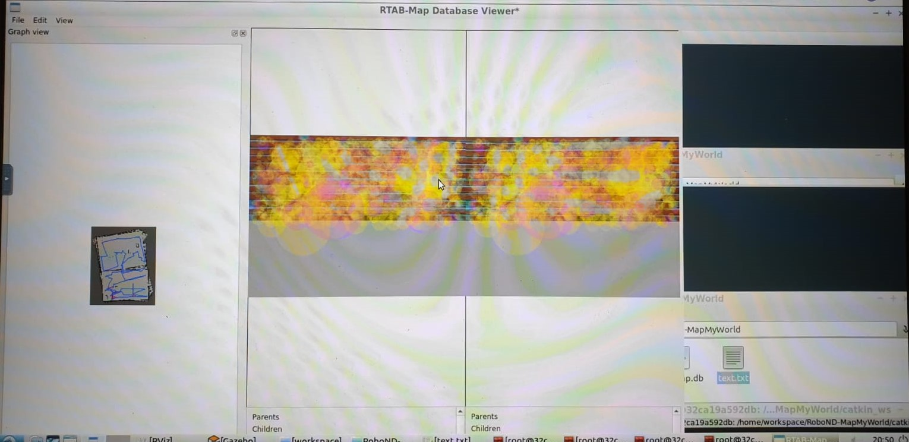

# RoboND-MapMyWorld

The objective of this project is to map the environment around the robot (created in the previous project) using RTAB . This is done by manually navigating the robot to different locations inside the world.

## Command to launch the launch files:

launch world:

		cd RoboND-WhereAmI
		source devel/setup.bash
		roslaunch my_robot world.launch
         
launch mapping:

		cd RoboND-WhereAmI
		source devel/setup.bash
		roslaunch my_robot mapping.launch
        
launch localization:

		cd RoboND-WhereAmI
		source devel/setup.bash
		roslaunch my_robot localization.launch
        
## For navigating robot towards different locations:

		rosrun teleop_twist_keyboard teleop_twist_keyboard.py
        
## For visualizing rtab:

		rtabmap-databaseViewer <path to database file>
        
        

         
         
         
        

